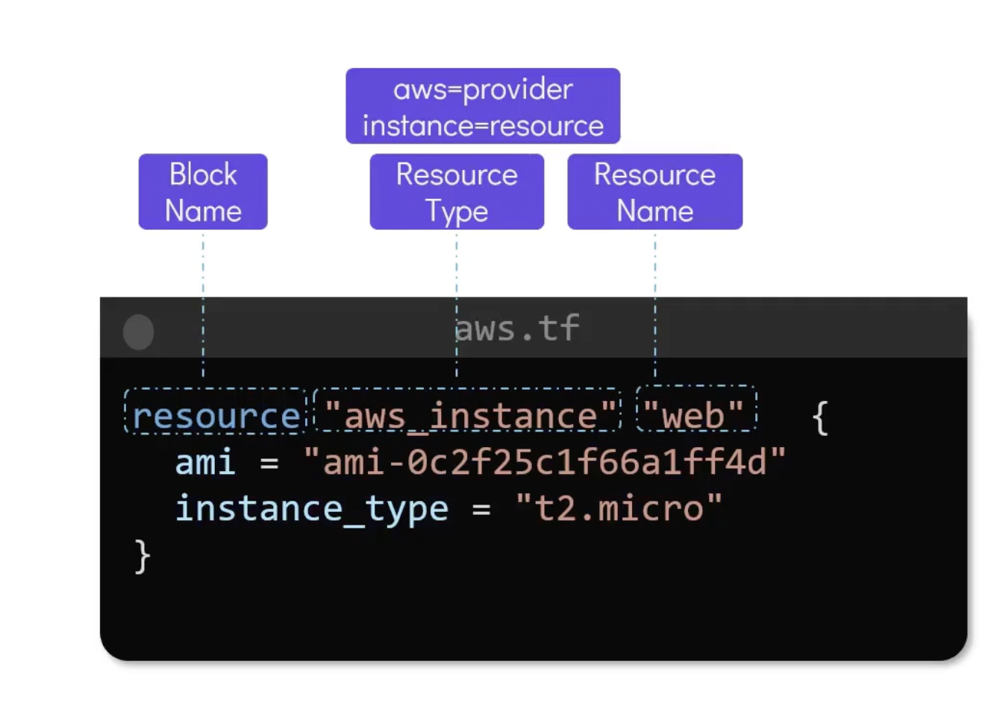

## Chap2 - IAC Concepts

### Types of IAC tools
- Configuration tools. i.e, ansible, puppet, saltstack. Designed to install softwares on already acquired infrastructure. These tools are idempotent means that performing the same operation multiple times has the same effect as performing it once
- Provisioning tools. Terraform, Cloudformation. Terraformer is vendor agnostic providing multiple providers. Tracks the management of states of infratructure through statefiles.
- Server Templating, Docker, Packer, Vagrant. Docker images, AMI etc. Immutable infrastructure, means after creation, the configuration of infra cannot be changed. If we want to change configuration, new infra will be created after replacing older version.

### Terraform Basics

Configuration files are written in HCL (HashiCorp Configuration language)

Resource - An infra object that terraform manages.
Terraform workflow - init ->plan->apply
`terraform show` - to show the current state of infrastructure

### Create, Delete, Update resources
- Create, Update `terraform plan -out main.tfplan && terraform apply`
- Destroy `terraform destroy`