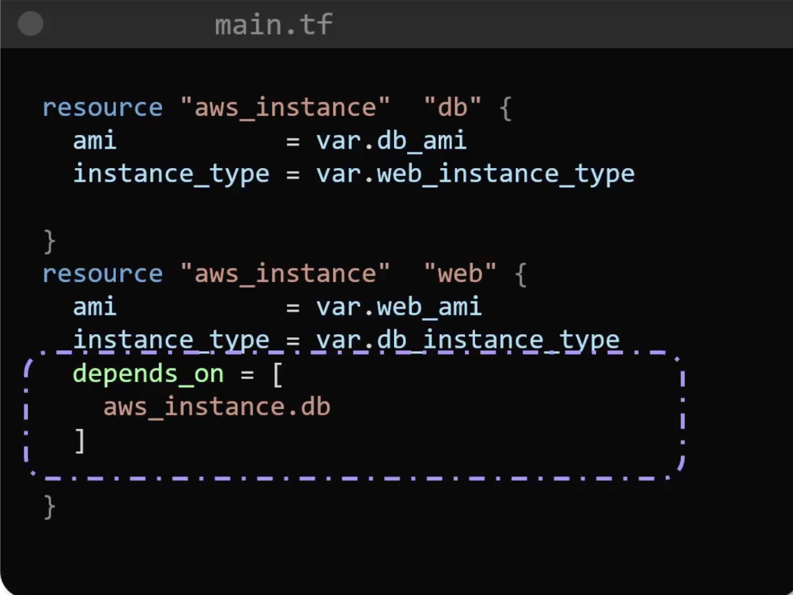
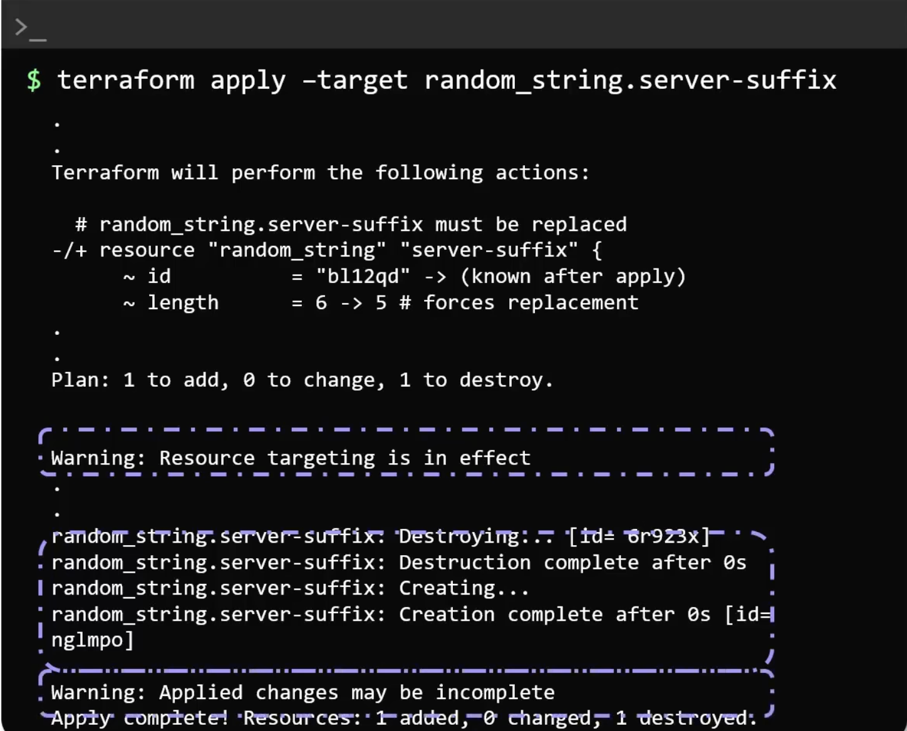
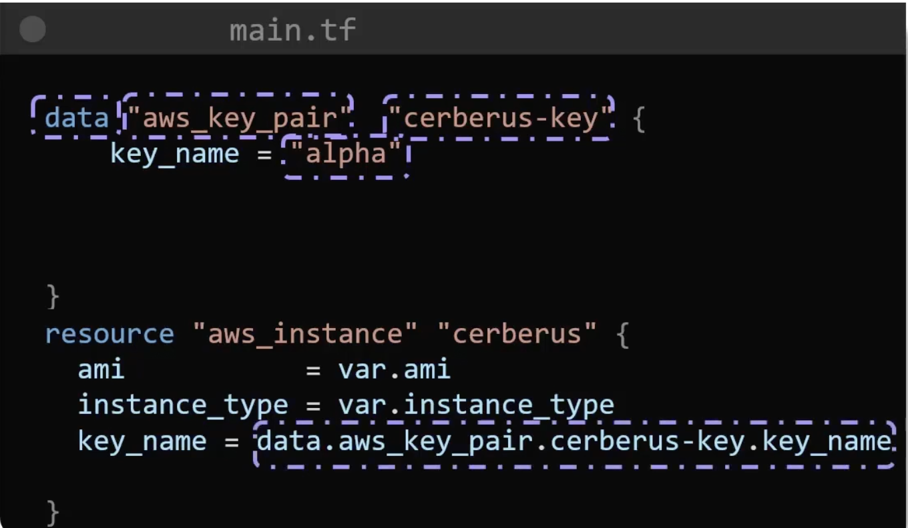
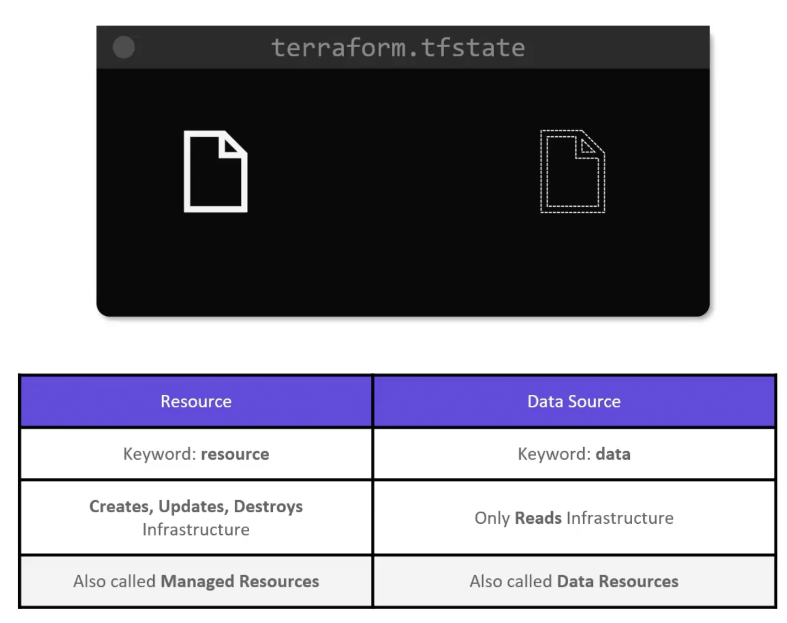

## vairbales, resource attributes and dependencies

- Outputs can also be marked as sensitive to ensure that sensitive outputs wont be displayed on cli.
- The sensitive varibales are and outputs are still available as plain text in statefiles, so we need to make sure we secure statefiles.
- Terraform creates resources in parallel but if a resource is dependent on another, it will create resources in order. (implicit dependencies)
- We can also explicitly define dependencies between resources. i.e db will be created before web instance.

- Interpolation syntax - allows you to reference variables, attributes of resources, call functions. `${}`. i.e, `web-${aws_key.private_key.id}`

### Resource Targeting
To modify a targeted resource, it is being used like this. If we dont mention `-target`, all resources dependednt on this resource will be re-created. This should be used with caution and in rare-cases.

## Data sources
To reference already existing resources. i.e,

Data sources vs resources

The behavior of `local-only` data sources is the same as all other data sources, but their result data exists only temporarily during a Terraform operation, and is re-calculated each time a new plan is created.