## Chap4 - Variables

### defining variables
- To define variable in `varibales.tf`, if we dont mention default value, we will be prompted when running `terraform apply`
```
varibale "filename" {
    default = "/etc/host.txt"
}
```
- To reference;
```
var.filename
```
- we can also use `-var "filename=/etc/host.txt"` flag while running terraform commands. Environmental variables like `TF_VAR_filename="/etc/host.txt"`
- we can define all varibales in varibales definition files. `*.tfvars, *.tfvars.json, *.auto.tfvars, *.auto.tfvars.json`. 
- If using variable definiton files, we have to mention it like `terraform apply -var-file *.tfvars`.
- variable precedence in terraform. `-var or -var-file` has the highest precedence.
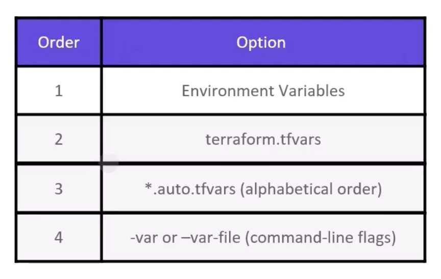

### using variables
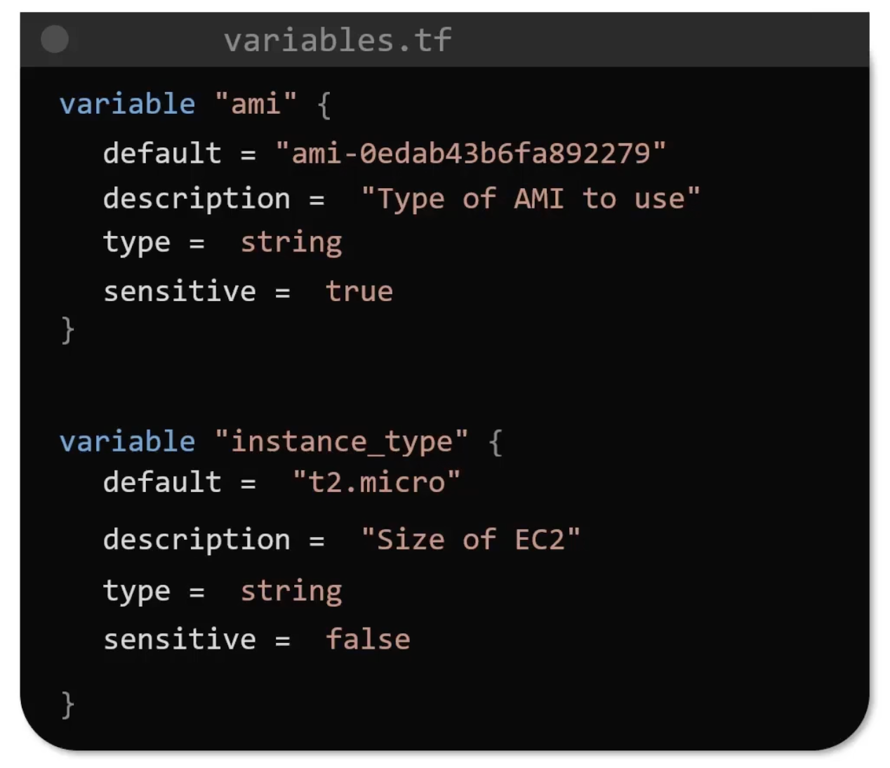

`sensitive` if true, variables will only be recorded in statefile and supressed during terraform operations.

### validation rules for input variables
we can add validation block for input variables, i.e,
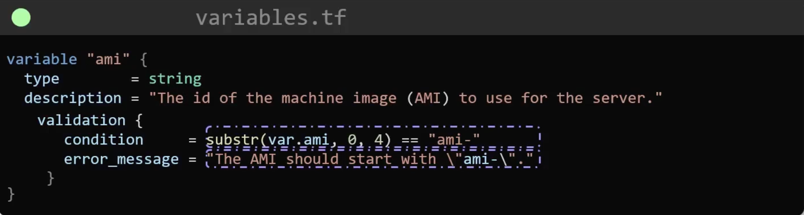

variable types are `string | number | bool | any (default)`
typeconversion can be happened from bool to string (vice versa), string to number (viceversa). Below example, typeconversion is not possible.
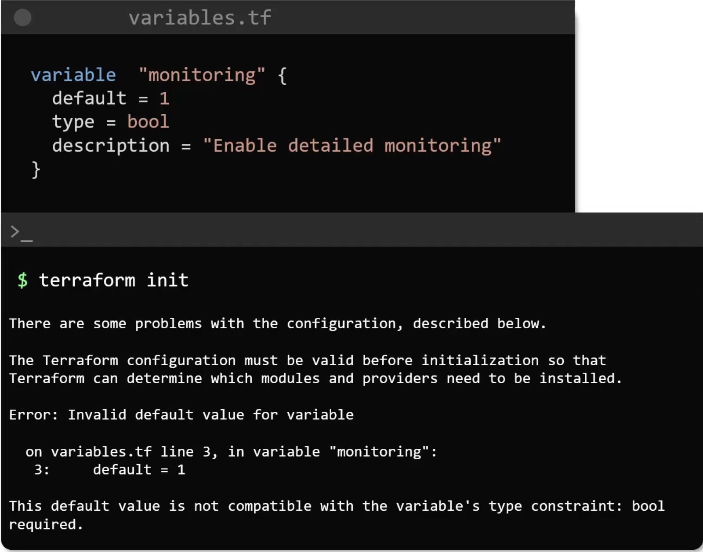

**list** type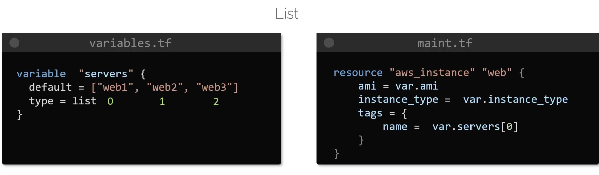
**list of a type**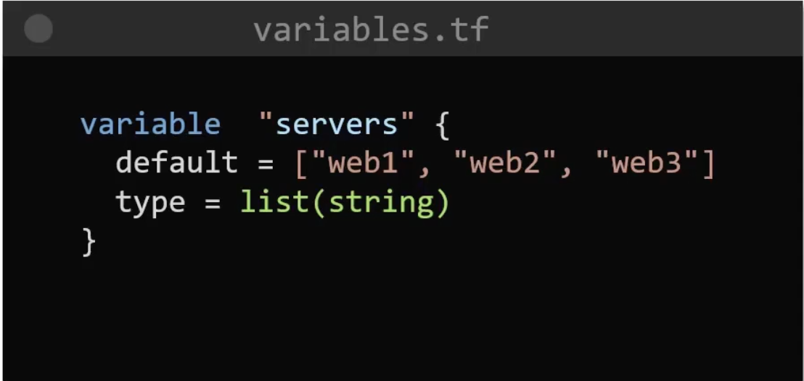

**map**
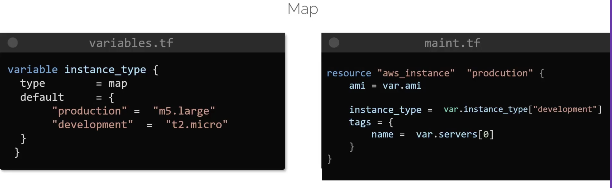
**map of a type**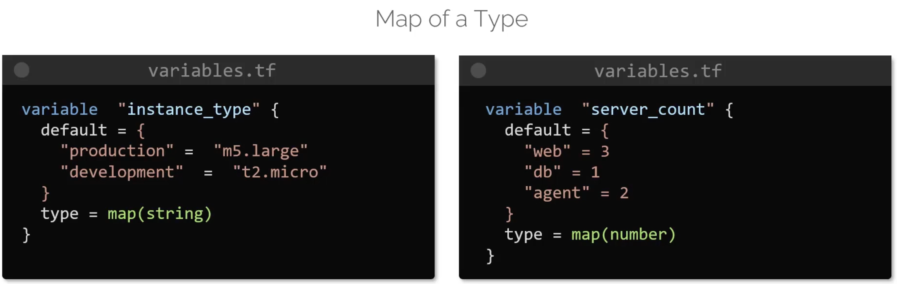

**Sets**: Like list but cant have duplicated values.


**objects**
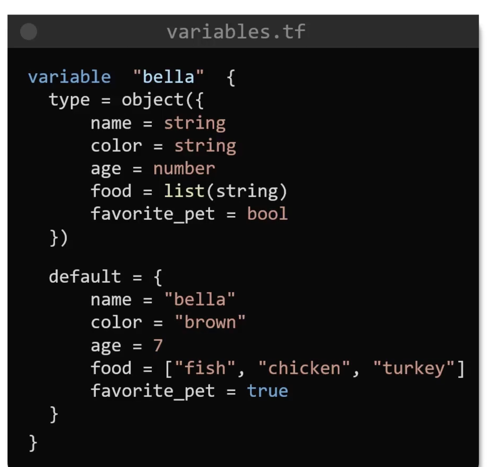

**tuple**: List of different types
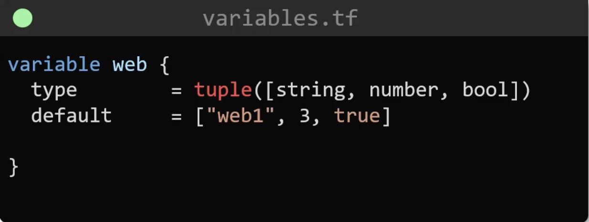

### Output variables
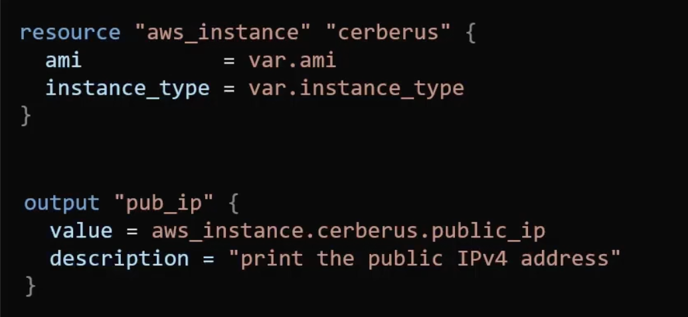
- `terraform output`command to display output.

